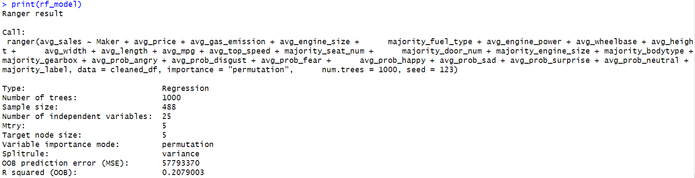
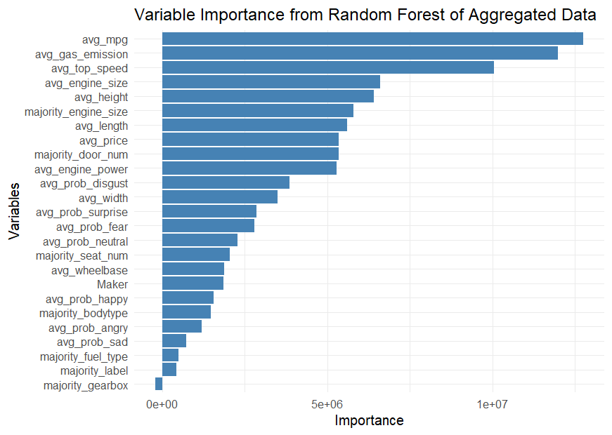

```{r setup, include=FALSE}
knitr::opts_chunk$set(echo   =FALSE,      ## show or suppress the code
                      include=TRUE ,      ## show or suppress the output
                      message=FALSE,      ## omit messages generated by code
                      warning=FALSE,      ## omit warnings generated by code
                      comment=NA,         ## removes the ## from in front of outputs
                      fig.align="center", ## centers all figures
                      fig.height = 5,     ## set the default height
                      fig.weight = 5      ## set the default width
                      )
```

## Abstract

Understanding the factors that influence car sales is essential for the automotive industry. In this project, we analyze various variables, including the reputation of the car brand (rate) and the "facial expressions" of cars, to evaluate their impact on sales performance. Leveraging data from Deep Visual Marketing, we applied random forest, linear regression, backpropagation neural network, and recurrent neural network to identify the key determinants of car sales. Contrary to our hypothesis, we found that while variables like fuel consumption, car model, and size significantly influence sales, the perceived facial expressions of cars do not. These findings provide valuable insights for manufacturers aiming to optimize sales strategies.


## Introduction 

Understanding the determinants of car sales is a critical area of research within the automotive industry. As consumer preferences evolve, both functional attributes such as fuel efficiency and aesthetic elements such as design play essential roles in purchasing decisions. Recent advancements in machine learning have enabled researchers to analyze large datasets, uncovering nuanced insights into what drives sales performance. Motivated by these developments, this study aims to investigate the impact of various factors, including car brand reputation, physical dimensions, and perceived "facial expressions," on car sales. While prior research highlights the importance of functional characteristics like fuel consumption and engine performance, the role of visual design elements remains underexplored. This project seeks to address this gap by combining traditional statistical methods with state-of-the-art machine learning models.

The dataset used in this study was obtained from the Deep Visual Marketing platform and consists of 5,269 car records, each containing detailed attributes. These include physical specifications (e.g., engine size, dimensions), performance metrics (e.g., fuel consumption, average sales), and sentiment-based probabilities derived from visual features resembling emotions (e.g., happiness, sadness). Preprocessing steps such as imputation for missing values, feature scaling, and one-hot encoding were applied to prepare the data for modeling.

By examining both practical and aesthetic factors, this study provides a comprehensive analysis of car sales determinants, offering valuable insights for the automotive industry to refine its design, production, and marketing strategies.


## Data exploration and visualization 
```{r, include=F}
1+1
```


## Modeling/Analysis

This project employed two datasets to investigate the factors influencing car sales and evaluate the predictive performance of different modeling approaches. The first dataset contained aggregated data, where sales for each car model were averaged across all years. The second dataset included yearly sales records for each car model, providing a more granular view of temporal sales patterns. Both datasets were analyzed using linear regression and backpropagation neural networks (BPNN), enabling a thorough comparison of model performance and insights across different data structures.

### Assumptions

1. **Linear Regression**:
   - Linearity: Assumes a linear relationship between avg_sales and predictors such as avg_price and avg_engine_power. This assumption may not fully capture complex interactions between features like majority_bodytype and avg_mpg, which are addressed through alternative models.
   - Independence: Assumes predictors are not highly correlated. Multicollinearity among related variables like avg_width, avg_height, and avg_length was addressed where necessary to ensure stable coefficient estimates.
   - Normality: Assumes that residuals are normally distributed. Outliers (e.g., cars with extremely high sales due to brand popularity or aggressive marketing) might violate this assumption and will be removed.
2. **Random Forest**:
   - Independence of Observations: Assumes that each car model’s sales data is independent, which was ensured by aggregating the data by model to eliminate repeated entries.
   - No Assumption of Linearity: Captures non-linear relationships naturally, such as interactions between avg_engine_power and majority_fuel_type, making it particularly suited for complex datasets.
   - Handling of Missing Data: Assumes consistent patterns of missingness, which were addressed through reliable imputation methods for any missing values in predictors.
3. **Backpropagation Neural Network (BPNN)**:
   - Non-Linearity: Assumes the network can effectively model non-linear relationships, making it well-suited for capturing interactions among predictors like avg_prob_disgust, majority_gearbox, and avg_engine_size.
   - Feature Scaling: Assumes that predictors are properly scaled to allow efficient convergence during gradient descent. All numeric features were standardized to ensure model stability.
   - Large Dataset Requirement: Assumes sufficient data availability to train  qthe network without overfitting. Although the dataset size was moderate, overfitting risks were minimized using dropout layers and weight regularization.
   - Independence of Observations: Assumes that observations are independent, which was maintained by aggregating sales data per car model.
4. **Recurrent Neural Network (RNN)**:
   - Sequential Data Assumption: Assumes temporal or sequential dependencies in the dataset, such as year-to-year patterns in car sales trends. This assumption aligns directly with the yearly dataset used for this analysis, where sales for each model were observed over multiple years.
   - Stationarity: Assumes that the temporal relationships in predictors (e.g., avg_price, avg_gas_emission) and the target (avg_sales) remain consistent across time. This assumption was addressed by checking for non-stationarity and applying transformations like differencing or detrending where needed.
   - Feature Scaling: Requires scaled predictors for stable gradient updates during training. To satisfy this assumption, all numeric variables were standardized prior to model fitting.

### Observations, Predictors, and Outcome

- Aggregated Dataset:
  - Observations: Rows represent unique car models, each summarized with average values for both numerical and categorical variables across all years.
  - Predictors: A combination of: 
    - Physical Attributes: Includes variables like avg_engine_power, avg_gas_emission, avg_wheelbase, avg_mpg, avg_height, avg_width, and avg_length, reflecting the physical specifications of each car model.
    - Categorical Features: Includes majority_fuel_type, majority_bodytype, majority_gearbox, majority_seat_num, and majority_door_num, representing the dominant characteristics for each model.
    - Sentiment-Based Features: Variables like avg_prob_happy, avg_prob_sad, and avg_prob_disgust quantify inferred emotional sentiment towards each model.
  - Outcome (\(y\)): The average sales (avg_sales) of each car model across all available years, providing a summarized measure of performance.
  
- Yearly Dataset:
  - Observations: Rows represent yearly sales data for each car model, capturing more granular trends and patterns over time.
  - Predictors: Includes all predictors from the aggregated dataset, with the addition of:
    - Year: Captures temporal trends and changes in performance across time.
    - Annual Variability: Predictors reflect year-specific performance or conditions, such as avg_price or sentiment probabilities (e.g., avg_prob_happy) for a given year.
  - Outcome (\(y\)):  The annual sales (Sales) for each car model in a given year, providing a detailed view of temporal variations in performance.

### Models and Their Representations
1. **Linear Regression**:
   - Aggregated Dataset: \( y = \beta_0 + \sum_{i=1}^{p} \beta_i X_i + \epsilon \)
   - Yearly Dataset: An additional predictor, Year, was included to account for temporal trends in annual sales (Sales). The coefficients reflect the expected change in yearly sales for a one-unit increase in the corresponding predictor, holding other variables constant.
   - Coefficients represent the expected change in sales for a one-unit increase in the corresponding predictor, holding all other variables constant.
2. **Random Forest**:
   - A non-parametric, tree-based ensemble model was implemented to capture non-linear relationships and interactions among predictors.
   - Aggregated Dataset: The model identified important features influencing long-term sales trends across car models. Random forest’s ability to rank feature importance helped in understanding drivers of average sales.
   - Yearly Dataset: Random forest also captured temporal dynamics by incorporating Year and other predictors, identifying how the importance of variables such as avg_price or majority_fuel_type fluctuates over time.
3. **Backpropagation Neural Network (BPNN)**:
   - A multi-layer perceptron with ReLU activation functions and dropout layers was implemented.
   - Model architecture and hyperparameters (e.g., learning rate, number of layers, and hidden units) were optimized separately for each dataset.
   - The non-linear nature of BPNN allows for capturing complex relationships and interactions among predictors.
4. **Recurrent Neural Network (RNN)**:
   - Yearly Dataset Only: RNNs were applied to the yearly dataset to model sequential dependencies in car sales over time. Long Short-Term Memory (LSTM) units were used to manage long-term dependencies and mitigate vanishing gradient issues.
   - The model incorporated both year-specific predictors (e.g., avg_price, avg_prob_happy) and temporal patterns (Year) to predict annual sales. RNNs excelled in identifying trends and evolving relationships that could not be captured by static models.

### Performance Metrics

**Aggregated Dataset**

We employed three different models to predict average sales across car models:

  1. **Linear Regression**:
  
   - R-squared: Measures the proportion of variance in sales explained by the predictors.
   - Mean Absolute Error (MAE): Represents the average absolute difference between predicted and actual sales.
   
  2. **Random Forest**:
  
```{r}
  
```
     
   - Out-of-Bag (OOB) R-squared: The model achieved an R-squared (OOB) value of 0.2079, which indicates that approximately 20.79% of the variance in avg_sales is explained by the predictors. While this suggests the model is capturing some patterns in the data, the relatively low R-squared indicates limited predictive power for this specific dataset. Potential reasons include: 
    1. High variance in avg_sales that cannot be explained by the available predictors; 
    2. Presence of noise or unobserved variables that influence car sales (e.g., marketing strategies, economic conditions).
   
   - Out-of-Bag (OOB) Prediction Error: The model’s Mean Squared Error (MSE) on OOB samples is 5,779,337.0, representing the average squared difference between predicted and actual avg_sales. The high value of the MSE is influenced by large variations in sales across different car models (ranging from 1 to over 84,000).  
   
   - The relatively low R-squared value suggests that either the predictors do not fully capture the complexity of factors influencing car sales or that random forest, despite being flexible, struggles with the inherent noise in the data.

  3. **Backpropagation Neural Network (BPNN)**:
  ...

**Yearly Dataset**

We employed random forest and RNN models.

  
## Visualization and interpretation of the results

```{r fig.align='center'}

```
  

## Conclusions and recommendations
This study provides a comprehensive analysis of the factors influencing car sales by leveraging machine learning and statistical methods. The results indicate that practical attributes such as fuel efficiency, car size, and engine specifications significantly impact sales performance, while perceived facial expressions in car designs have no measurable influence. These findings challenge the assumption that aesthetic features play a pivotal role in consumer purchasing decisions, emphasizing the dominance of functional attributes.

Based on these insights, manufacturers are encouraged to focus on improving fuel efficiency, optimizing vehicle dimensions, and enhancing engine performance to align with consumer priorities. Marketing strategies should highlight these practical benefits to resonate with the target audience. Although facial expressions did not emerge as a critical factor, future research could explore other design elements that may influence niche markets or specific consumer segments.

Future work could involve expanding the dataset to include additional regions or markets, allowing for a more comprehensive analysis of global trends. Incorporating temporal data, such as seasonal sales patterns or economic conditions, could also provide deeper insights into sales dynamics. Furthermore, integrating social media sentiment analysis might uncover hidden factors that contribute to consumer behavior. By addressing these areas, future studies can build on this research to provide even more actionable recommendations for the automotive industry.


## References

